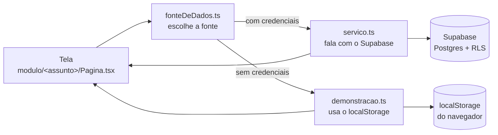

# Como o Aurora é organizado

Este documento é para quem abriu o projeto e quer saber por onde começar.
Leia daqui até o fim uma vez (dá cinco minutos) e depois use como referência.

## A ideia em uma frase

Um dashboard pessoal com cinco assuntos — hábitos, livros, finanças, metas e
humor —, cada um com a mesma anatomia: uma tela, um serviço que fala com o
banco, e uma cópia desse serviço que finge o banco usando o navegador.

## O que fica onde

```
src/
  app/                 o app ligando: main → App → rotas
  estilo/              o CSS do Tailwind
  compartilhado/       o que serve a todos os módulos
    componente/        Botao, Cartao, Campo, Modal, Carregando, EstadoVazio,
                       CartaoIndicador, RotaProtegida
    moldura/           Moldura, Cabecalho, MenuLateral, AvisoDeDemonstracao
    gancho/            useDados (busca com carregando/erro), useTema,
                       contextoDeAutenticacao + ProvedorDeAutenticacao + useAutenticacao
    utilitario/        formato.ts (moeda, data, porcentagem)
    tipo/              banco.ts — as tabelas do Supabase em TypeScript
    fonte/             supabase.ts, fonteDeDados.ts, armazenamentoDeDemonstracao.ts
  modulo/
    habito/            Pagina, servico, demonstracao, componente/
    livro/             idem
    financa/           idem
    meta/              idem + regraDeProgresso (com teste)
    humor/             idem + regraDeComparacao (com teste)
    painel/            a tela inicial, que cruza os outros módulos
    conta/             entrar, cadastrar, configurações
```

A regra é: **tudo de um assunto mora junto**. Abriu `modulo/humor/`, está lá a
tela, o serviço, a versão de demonstração, a regra de negócio e o teste dela.
Se você precisou abrir quatro pastas para entender uma funcionalidade, alguma
coisa foi guardada no lugar errado.

## O caminho de um clique



A tela **nunca** importa `servico.ts` direto. Ela importa de
`@/compartilhado/fonte/fonteDeDados`, e é esse arquivo — o único do projeto que
sabe da existência dos dois modos — que decide qual implementação entregar.

Por isso `servico.ts` e `demonstracao.ts` de um mesmo módulo têm sempre os
**mesmos métodos, com os mesmos parâmetros e os mesmos retornos**. Acrescentou
método em um, acrescente no outro.

### Um exemplo de verdade: marcar o humor de hoje

1. Você clica no emoji em `modulo/humor/componente/RegistroDoDia.tsx`.
2. O componente chama `ServicoDeHumor.gravarRegistroDoDia({ date, mood, energy })`,
   importado de `@/compartilhado/fonte/fonteDeDados`.
3. Com Supabase configurado, cai em `modulo/humor/servico.ts`, que lê o dia
   (para saber se é inserção ou edição) e grava na tabela `mood_logs`.
   Sem Supabase, cai em `modulo/humor/demonstracao.ts`, que faz o mesmo sobre o
   localStorage.
4. A tela recarrega os dados e as médias mudam na hora.
5. Quando a tela de Humor pede a comparação com hábitos, `modulo/painel/servico.ts`
   carrega hábitos, marcações e humores e entrega os três para
   `modulo/humor/regraDeComparacao.ts`, que é código puro — sem banco, sem React —
   e por isso é o único pedaço com teste automatizado.

## Onde as decisões moram

| Pergunta | Arquivo |
| --- | --- |
| Que endereços existem? | `app/rotas.tsx` |
| O que aparece no menu? | `compartilhado/moldura/MenuLateral.tsx` |
| Quem está logado? | `compartilhado/gancho/useAutenticacao.ts` (o gancho); `ProvedorDeAutenticacao.tsx` (a lógica) |
| Estamos no modo demonstração? | `compartilhado/fonte/supabase.ts` |
| Quais são as tabelas? | `compartilhado/tipo/banco.ts` e `supabase/schema.sql` |
| Quando uma meta conta como concluída? | `modulo/meta/regraDeProgresso.ts` |
| Como se compara hábito com humor? | `modulo/humor/regraDeComparacao.ts` |
| Que dados a prévia mostra? | `compartilhado/fonte/armazenamentoDeDemonstracao.ts` |

## Combinados de escrita

**Idioma.** Pastas, arquivos, componentes, funções, variáveis, comentários e
rotas em português. Ficam em inglês, de propósito:

- **nomes de coluna do banco** (`name`, `title`, `user_id`, `mood`, `date`) —
  eles existem assim no Postgres; traduzir aqui criaria um dicionário a mais
  para você decorar, e a forma abreviada do JavaScript (`{ mood, energy }`)
  transformaria um rename inocente em bug de gravação;
- **APIs de biblioteca** (`useState`, `className`, `onClick`, `handleSubmit` do
  react-hook-form, `data`/`error` do supabase-js) — são delas, não nossas.

**Imports.** Sempre absolutos, com `@/` apontando para `src/`. Um import diz de
onde a coisa vem sem depender de quantas pastas acima o arquivo está — nada de
`../../../`.

**Nomes de arquivo.** Componente em `MaiusculaCamelo.tsx`; o resto em
`minusculaCamelo.ts`. Cada módulo tem `Pagina.tsx`, `servico.ts` e
`demonstracao.ts` com esses nomes exatos, para você saber o que vai achar antes
de abrir.

**Busca de dados na tela.** Toda tela busca pelo `useDados`, em
`compartilhado/gancho/useDados.ts`. Ele devolve `dados`, `carregando`, `erro` e
um `recarregar()`, e ja trata o try/catch. Nao escreva `useEffect` com
`setState` na pagina: era isso que o lint apontava em todas elas.

**Carregamento das telas.** Cada rota baixa a sua tela sob demanda, pelo
`lazy` do React em `app/rotas.tsx`. Quem abre o Painel nao baixa o codigo do
grafico de financas junto. Tela nova entra por ali, na funcao `tela()` — se
voce importar a pagina direto no topo do arquivo, ela volta para o pacote
inicial e todo mundo passa a baixa-la.

**Um arquivo, um tipo de coisa.** Componente num arquivo, constante em outro,
gancho em outro. Nao e purismo: o React so consegue recarregar a tela sem
perder o estado (fast refresh) quando o arquivo exporta apenas componentes —
e o lint avisa quando isso quebra.

**Cabeçalho.** Todo arquivo começa com um bloco dizendo o que ele faz e quem o
usa. Arquivo novo sem cabeçalho é arquivo pela metade.

**Testes.** Só as regras puras de negócio têm teste automatizado
(`regraDeProgresso`, `regraDeComparacao`). Não é preguiça: é onde mora a decisão
que dá para errar em silêncio. Tela quebrada você vê; regra errada, não.

## Para acrescentar um módulo novo

1. Crie a tabela em `supabase/schema.sql` e acrescente o nome dela ao array do
   bloco `do` que gera as políticas de RLS.
2. Descreva a tabela em `compartilhado/tipo/banco.ts` (Linha, ParaInserir,
   ParaAtualizar) e registre no mapa `Banco`.
3. Crie `modulo/<assunto>/servico.ts` e `modulo/<assunto>/demonstracao.ts` com a
   mesma lista de métodos.
4. Registre os dois em `compartilhado/fonte/fonteDeDados.ts`.
5. Crie `modulo/<assunto>/Pagina.tsx`, a rota em `app/rotas.tsx` e o item em
   `MenuLateral.tsx`.
6. Se houver regra de negócio (algo que dá para calcular errado), coloque em
   `modulo/<assunto>/regra*.ts` e escreva o teste antes da implementação.

## Como verificar seu trabalho

```bash
npm run build   # inclui o typecheck; é a rede de segurança contra rename torto
npm run lint
npm test
npm run dev     # e olhe o app
```

O CI (`.github/workflows/ci.yml`) roda os três em todo pull request.
